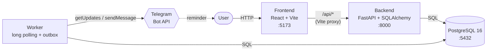
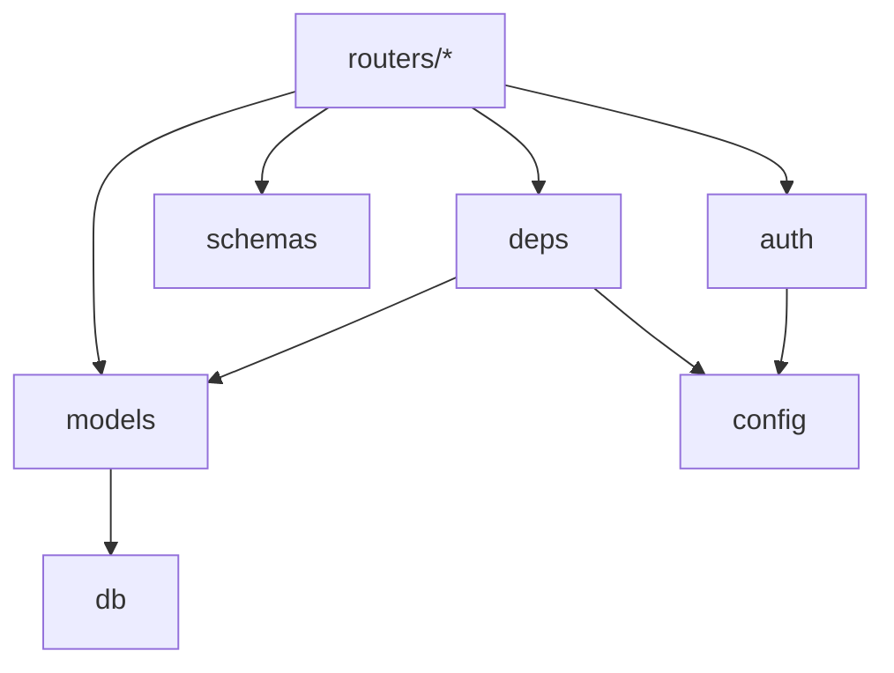
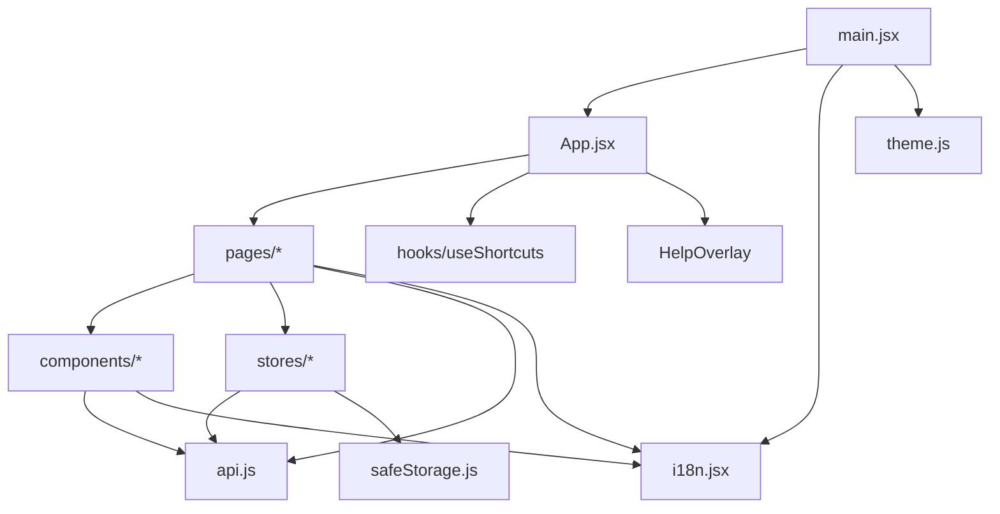
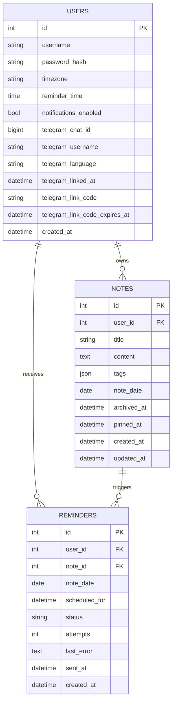

# Architecture

A small, single-user-per-account notes app. Three services, one repo.

## System overview



| Service    | Stack                                              | Port | Role                                        |
| ---------- | -------------------------------------------------- | ---- | ------------------------------------------- |
| `db`       | Postgres 16                                        | 5432 | Durable storage                             |
| `backend`  | Python 3.11, FastAPI, SQLAlchemy 2.0, Alembic, JWT | 8000 | REST API, auth, data access                 |
| `worker`   | Python 3.11, same image as `backend`               | —    | Telegram long polling, reminder delivery    |
| `frontend` | React 18, Vite, React Router, Zustand              | 5173 | SPA; dev server proxies `/api` to `backend` |

All four are orchestrated by `docker-compose.yml`. The frontend talks to the backend through the Vite dev proxy — there is no direct browser → backend call in dev.

`worker` runs exactly one replica. The Bot API answers a second concurrent `getUpdates` on the same token with `409 Conflict`, so polling cannot be scaled horizontally; delivery could be, because due rows are claimed with `FOR UPDATE SKIP LOCKED`.

## Components & responsibilities

### Services

- **`db`** — owns all persistent state. No logic lives here beyond schema (managed by Alembic) and ownership indexes. External deps: none. Data volume: `db_data`.
- **`backend`** — owns authentication (JWT issuing and verification), authorization (per-row `user_id` filtering), domain logic (notes, tags, calendar aggregation, archive/pin semantics, pagination), and request validation (Pydantic). Exposes HTTP only — anything that has to run without an incoming request lives in `worker`.
- **`worker`** — the only component that runs on its own clock. Long-polls the Bot API for `/start` deep links, and on a 30-second cadence reconciles the reminder outbox and delivers what is due. Shares the `backend` image and the `app/` package; the process itself holds no domain logic. Kept out of the API process because `backend` runs under uvicorn `--reload`, which would restart a background loop on every file change.
- **`frontend`** — a pure SPA. Holds no server state. What it keeps between visits lives in four `localStorage` keys — the JWT, the language, the theme and one dismissed hint — all written through `stores/safeStorage.js`. Talks only to `/api/*` via the Vite dev proxy. Owns layout, user interaction, optimistic UX affordances (markdown preview, keyboard shortcuts, calendar rendering).

### Backend packages



- **`app/main.py`** — process entry point. Mounts CORS, routers, `/healthz`. No business logic.
- **`app/config.py`** — single source of truth for runtime configuration (`DATABASE_URL`, `JWT_SECRET`, etc.). Everything else imports `settings` from here.
- **`app/db.py`** — owns the SQLAlchemy engine, session factory, and `Base` (DeclarativeBase). Nothing else instantiates engines.
- **`app/models.py`** — ORM entities (`User`, `Note`). The only place that declares table shape.
- **`app/schemas.py`** — Pydantic DTOs for request bodies and responses. Decoupled from ORM so wire format can evolve independently (e.g., hiding fields from public responses).
- **`app/auth.py`** — password hashing (bcrypt) and JWT encoding. Pure functions; no I/O.
- **`app/telegram.py`** — thin Bot API client (`getUpdates`, `sendMessage`) over `httpx`. Raises `TelegramRetryAfter` for 429 so callers can honour `retry_after` literally. Never sets `parse_mode`: notes are Markdown, and unbalanced markup would make the API reject real notes with 400. The token lives in the request URL, so no error path echoes the URL.
- **`app/bot_i18n.py`** — message catalogue for everything the bot says, plus the mapping from an
  IETF tag to a language we have. English is the fallback, matching `i18n.jsx`.
- **`app/bot_commands.py`** — the single entry point for an incoming update: parses the command,
  routes it and renders the reply. Everything the bot says lives here, so there is one place to
  look for what a user will read.
- **`app/telegram_link.py`** — issuing and redeeming `/start` deep-link codes (15-minute TTL, single use). Binding is what turns notifications on; unlinking turns them off. Returns a `LinkResult`; the wording that reaches the user belongs to `bot_commands`.
- **`app/reminders.py`** — reminder scheduling: local-time → UTC conversion, outbox materialisation, resync after settings changes, cancellation of rows whose preconditions lapsed, claiming and marking. Pure domain logic over a `Session`.
- **`app/deps.py`** — FastAPI dependencies: `get_db` (per-request session lifecycle) and `get_current_user` (JWT → `User`). Every protected route goes through `get_current_user`.
- **`app/routers/*`** — HTTP surface. Each router owns one area (`auth`, `account`, `notes`, `tags`) and is the **only** place allowed to call the ORM directly. Routers never import each other.
- **`alembic/versions/*`** — schema migrations, applied at container start. Must be reversible (both `upgrade` and `downgrade`).
- **`scripts/seed.py`** — idempotent demo data. Replaces the demo notes but leaves the account
  alone: it used to delete the user, which meant every re-seed silently dropped the Telegram
  binding and the reminder preferences. Only the password is forced back, so the credentials
  in the README stay true.
- **`scripts/dump_openapi.py`** — emits `app.openapi()` JSON; drives `make openapi-dump` and the drift test.

### Frontend packages



- **`main.jsx`** — app bootstrap: calls `initTheme()`, wraps the tree in `LangProvider` and `BrowserRouter`.
- **`App.jsx`** — route map, top-level header, global shortcut wiring, registers actions forwarded from `Notes.jsx` (new/search/save) so shortcuts can reach them.
- **`api.js`** — the single network seam. Centralizes the `Authorization` header (token read from `stores/sessionStore`), the 401 that ends a session, and the JSON envelope. No page talks to `fetch` directly.
- **`stores/safeStorage.js`** — the only module that touches `localStorage` directly, and the
  successor to the boundary `auth.js` used to hold. Read, write and remove never throw: a browser
  that refuses storage (private mode, enterprise policy) would otherwise take the app down at import
  time, because `persist` hydrates before the first render. The first failure logs once and flips a
  flag the session store exposes as `persistAvailable`, so the degradation is visible rather than
  silent.
- **`theme.js`** — `light` / `dark` / `system` via a `data-theme` attribute on `<html>`. Listens to `prefers-color-scheme` when the preference is `system`.
- **`i18n.jsx`** — React Context provider, `t(key, vars)` hook, EN fallback when RU is missing. The only translation mechanism.
- **`hooks/useShortcuts.js`** — global `keydown` listener; ignores editable targets except for `Cmd/Ctrl+S`.
- **`components/*`** — presentational + small behavior: `NoteEditor` (draft state + markdown toolbar), `NoteList` (virtualized-ready row), `TagFilter`, `ThemeToggle`, `LanguageToggle`, `MarkdownToolbar`, `HelpOverlay`.
- **`pages/*`** — screens with data-fetching and orchestration: `Login`, `Register`, `Notes` (list + editor + bulk + pagination + pin/archive), `Calendar`, `Settings`.
- **`stores/*`** — Zustand stores holding state shared beyond one screen, plus the async actions that own it. A mutation reloads what it invalidated, so no caller has to remember. Stores are headless: no `window`, no DOM, so they are unit-tested without React. `index.js` exports `resetStores()`, which the test setup calls after every test because a store is a singleton for the whole test process. Local state that nobody shares — form drafts, the calendar's visible month — stays in `useState` on purpose.

### Dependency rules worth keeping

- `routers/*` may depend on `deps`, `schemas`, `models`, `auth`; they must **not** depend on each other.
- `models` depends only on `db`. Business logic does not live here.
- Frontend `components/*` stay presentational; fetching lives in `pages/*`.
- `api.js` is the only module that calls `fetch`.
- Any new environment variable flows through `app/config.py` on the backend and through `import.meta.env` (`VITE_...`) on the frontend — never read directly from `process.env` or `localStorage` in business code.

## Data model



- **Reminders** are an outbox. `UNIQUE (note_id, note_date)` is what makes delivery exactly-once. The key is deliberately the calendar date and not `scheduled_for`: the latter is derived from the user's timezone and reminder time, so keying on it would let a settings change insert a second row while the first was still pending — two messages for one note.
- `status` moves `pending → sent | failed | cancelled`. A `cancelled` row still holds the key, so materialisation revives it if the note's date comes back; a `sent` row is never revived.

- **Tags** are a JSON array on the note itself. The `/tags` endpoint derives the per-user list by scanning the user's notes. There is no separate `tags` table by design.
- **Ownership** is enforced in every query via `user_id = current_user.id`. There is no sharing model and no RBAC.
- **Soft-delete** uses `archived_at` (nullable timestamp). Default list view excludes archived.
- **Pinning** uses `pinned_at` (nullable timestamp). Non-null → sorted on top.

## Backend layout

```
backend/
├── app/
│   ├── main.py         FastAPI app, CORS, router mounts, /healthz
│   ├── config.py       pydantic-settings, env-driven (.env)
│   ├── db.py           engine + SessionLocal + DeclarativeBase
│   ├── models.py       ORM (SQLAlchemy 2.0 Mapped[] typing)
│   ├── schemas.py      Pydantic in/out schemas
│   ├── auth.py         bcrypt hashing, JWT encode
│   ├── deps.py         get_db, get_current_user (JWT → User)
│   ├── telegram.py     Bot API client (getUpdates, sendMessage)
│   ├── bot_i18n.py     message catalogue for the bot (en / ru)
│   ├── bot_commands.py command routing and replies
│   ├── telegram_link.py deep-link codes, /start redemption
│   ├── reminders.py    scheduling, outbox reconciliation, delivery bookkeeping
│   └── routers/
│       ├── auth.py     /auth/register, /auth/login
│       ├── account.py  /account/change-password, settings, telegram link, DELETE /account
│       ├── notes.py    /notes CRUD, calendar, archive, pin, bulk-delete
│       └── tags.py     /tags
├── alembic/versions/   0001 init · 0002 archive+pin · 0003 telegram settings · 0004 reminders
│                       0005 (note_date, id) index · 0006 telegram language
├── scripts/
│   ├── seed.py         demo notes; keeps the account and its Telegram binding
│   ├── worker.py       long-polling loop + delivery tick (compose service `worker`)
│   └── dump_openapi.py regenerates openapi.json (make openapi-dump)
├── tests/              pytest + cov (threshold 80%)
└── openapi.json        snapshot — drift test asserts equality with app.openapi()
```

## Frontend layout

```
frontend/src/
├── main.jsx            bootstraps LangProvider + Router + App
├── App.jsx             route map, header, global shortcuts wiring
├── api.js              fetch wrapper + API client
├── theme.js            light / dark / system via data-theme attribute
├── i18n.jsx            React Context, EN + RU, dotted keys with {name} interpolation
├── stores/             notesStore · accountStore · sessionStore ·
│                       safeStorage · index.js (resetStores)
├── hooks/
│   └── useShortcuts.js global key bindings: n · / · Cmd+S · ? · Esc
├── components/         NoteEditor · NoteList · TagFilter ·
│                       ThemeToggle · LanguageToggle ·
│                       MarkdownToolbar · HelpOverlay
└── pages/              Login · Register · Notes · Calendar · Settings
```

Testing uses **vitest + jsdom + @testing-library/react**. Backend tests run independently with pytest against an in-memory SQLite per test.

## API surface

All paths are prefixed with `/api`. JWT is required everywhere except register/login and `/healthz`.

| Method              | Path                     | Notes                                                   |
| ------------------- | ------------------------ | ------------------------------------------------------- |
| POST                | `/auth/register`         | Public                                                  |
| POST                | `/auth/login`            | Public; returns JWT                                     |
| POST                | `/account/change-password` | Verifies current password                             |
| DELETE              | `/account`               | Cascade-deletes all notes of the user                   |
| GET                 | `/account/settings`      | Timezone, reminder time, notification and link status   |
| PATCH               | `/account/settings`      | Partial update; unknown IANA timezone → 422             |
| POST                | `/account/telegram/link` | Issues a deep link; 503 when the bot is not configured  |
| DELETE              | `/account/telegram`      | Unlinks and disables reminders; idempotent              |
| GET                 | `/notes`                 | Paginated (`limit`/`offset`), `?archived`, `?q`, `?tag` — pinned first |
| POST                | `/notes`                 | Create                                                  |
| GET / PUT / DELETE  | `/notes/{id}`            | Get / update / hard-delete                              |
| POST                | `/notes/{id}/archive`    | Idempotent                                              |
| POST                | `/notes/{id}/unarchive`  | Idempotent                                              |
| POST                | `/notes/{id}/pin`        | Idempotent                                              |
| POST                | `/notes/{id}/unpin`      | Idempotent                                              |
| POST                | `/notes/bulk-delete`     | Body: `{"ids": [int]}`                                  |
| GET                 | `/notes/calendar`        | `year`, `month`; excludes archived                      |
| GET                 | `/tags`                  | Distinct tag list for the user                          |
| GET                 | `/healthz`               | Liveness                                                |

The full machine-readable schema lives at `backend/openapi.json`. Regenerate with `make openapi-dump`; a drift test in the backend suite fails if the committed snapshot is stale.

## Cross-cutting concerns

- **AuthN** — JWT HS256, `JWT_SECRET` from env; token sent as `Authorization: Bearer <token>`.
- **AuthZ** — ownership check in every route; no roles, no sharing.
- **Migrations** — Alembic; `alembic upgrade head` runs at backend container startup.
- **i18n** — two languages (`en`, `ru`); EN is the fallback when a key is missing. The bot has its
  own catalogue in `app/bot_i18n.py`: it has no session and cannot read the browser's language, so
  it follows `language_code` from the Telegram update and records it on the account, refreshed on
  every update rather than written once at link time, so that reminders sent days later read the
  same way as the last answer did even for someone who switched their client language since.
- **Theming** — `data-theme="light|dark"` on `<html>`; `system` resolves from `prefers-color-scheme`.
- **Testing boundary** — backend uses SQLite in tests; any Postgres-specific SQL must stay behind SQLAlchemy or be called out. `claim_batch` uses `FOR UPDATE SKIP LOCKED`, which SQLite silently ignores — the locking behaviour is therefore asserted against the compiled Postgres SQL rather than by running two sessions.
- **Bot commands** — `/today`, `/upcoming`, `/status`, `/pause`, `/resume`, `/help`, published with
  `setMyCommands` once per supported language and once for the language-less scope, which is what
  clients outside `en`/`ru` resolve against. Publishing is advisory but not one-shot: a worker that
  could not reach Telegram at startup retries every five minutes until the menu takes. Everything
  but `/start` and `/help` needs a linked chat; an unlinked one is invited to link rather than told
  anything about an account.
- **Reminders** — a note's date fires at the owner's `reminder_time` in their `timezone`. Scheduling converts local → UTC once, at materialisation, and re-derives it whenever settings change. Rows are created up to 48 h ahead and never fire more than 24 h late, so a worker that was down does not flush a backlog. A cancelled row is revived only into the future, so the messages `/pause` suppressed are not delivered in a burst on `/resume`.
- **Configuration** — `TELEGRAM_BOT_TOKEN` and `TELEGRAM_BOT_USERNAME` reach the containers through `backend/.env`, which pydantic-settings reads directly (`env_file=".env"`, WORKDIR `/app`). They are deliberately *not* declared in compose `environment`: `${VAR:-}` interpolates to an empty string when no root `.env` exists and would silently override the file. Empty values are normalised to `None`, so a copied `.env.example` reads as "not configured" rather than "configured with a blank token".
